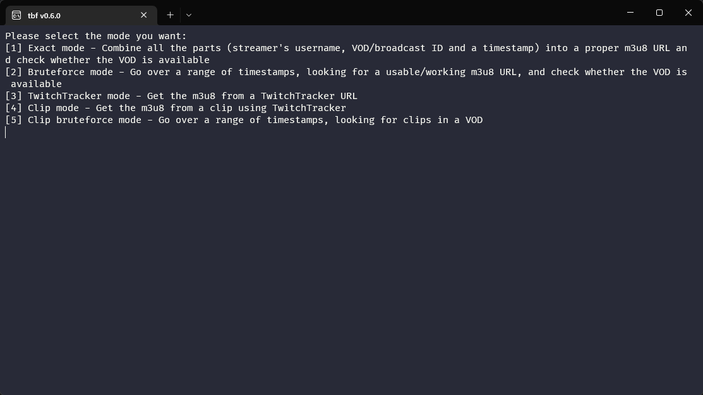

# tbf
Finds VOD playlists on Twitch.



## How to install

```cargo install --git https://github.com/vyneer/tbf```

or download the latest binary from the [Releases](https://github.com/vyneer/tbf/releases) page

## Subcommands

### None

```tbf```

Will ask you what mode you want and proceed from there.

### exact

```tbf exact [FLAGS] <username> <id> <stamp>```

```tbf exact destiny 39700667438 1605781794```

Combine all the parts (streamer's username, VOD/broadcast ID and a timestamp) into a proper m3u8 URL and check whether the VOD is available.

### bruteforce

```tbf bruteforce [FLAGS] <username> <id> <from> <to>```

```tbf bruteforce destiny 39700667438 1605781694 1605781894```

Go over a range of timestamps, looking for a usable/working m3u8 URL, and check whether the VOD is available.

### clipforce

```tbf clipforce [FLAGS] <id> <start> <end>```

```tbf clipforce 39700667438 0 3600```

Go over a range of timestamps, looking for clips in a VOD.

### link

```tbf link [FLAGS] <url>```

```tbf link https://twitchtracker.com/destiny/streams/41402441870```

Get the m3u8 from a TwitchTracker/StreamsCharts URL.

### live

```tbf link [FLAGS] <username>```

```tbf live forsen```

Get the m3u8 from a currently running stream.

### clip

```tbf clip [FLAGS] <clip>```

```tbf clip SpotlessCrypticStapleAMPTropPunch-H_rVu0mGfGLNMlEx```

Get the m3u8 from a clip using TwitchTracker.

### fix

```tbf fix [FLAGS] <url>```

```tbf clip https://vod-secure.twitch.tv/c03c3d945ff2b23bcbc3_pezz_40932307915_1656699046/chunked/index-dvr.m3u8```

Download and convert an unplayable unmuted Twitch VOD playlist into a playable muted one.

#### Flags

##### -o, --output

Set the output path (default is current folder).

##### -s, --slow

Use the old (slow, but more reliable) method of checking for segments.

## Flags

### -c, --cdnfile 

Import more CDN urls via a config file (TXT/JSON/YAML/TOML).

### -h, --help

Print help information.

### -s, --simple

Provide minimal output.

### -v, --verbose

Show more info.

### -m, --mode

Select the preferred processing mode for StreamsCharts [possible values: exact, bruteforce].

### -p, --progressbar

Enable a progress bar (which *might* slow stuff down according to [this](https://github.com/mitsuhiko/indicatif/issues/170))
